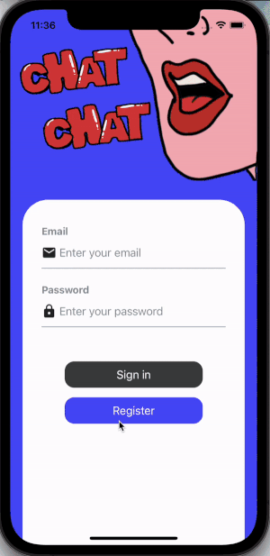

# React Native - Chat App /Meet Anonymous Friend App

This is a React Native Chat and Meet Anonymous Friend app built based on Google Firebase and Gifted Chat. This app allows users to register, sign in, explore new friends, and chat with friends.



## Screenshots


<!--  -->
## Features

- User registration and authentication using email and password
- User avatar and name
- Real-time messaging with friends using Gifted Chat
- Cloud Firestore database from Google Firebase
- User explores and add friends
- Meet friend feature

## Technologies Used

- React Native
- Firebase Authentication (email and password)
- Cloud Firestore database
- Gifted Chat

## Installation

To run this app, first clone this repository. Then, navigate to the project directory and run the following commands:

```
npm install
npx react-native run-ios
```

The corresponding dependence required:
```
npm install firebase react-native-gifted-chat react-native-dotenv react-native-swipe-list-view react-native-elements

```

## Credits

This app was built with the help of the following resources:

- [React Native](https://reactnative.dev/)
- [Firebase Authentication](https://firebase.google.com/docs/auth)
- [Cloud Firestore](https://firebase.google.com/docs/firestore)
- [Gifted Chat](https://www.npmjs.com/package/react-native-gifted-chat)

## License

This project is licensed under the MIT License 
